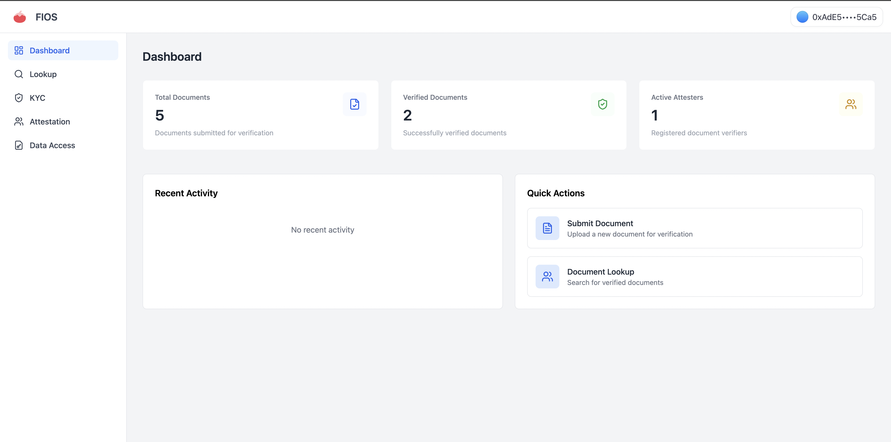

# FIOS (Flexible Identity Open Standard)

FIOS is a decentralized document verification platform built on Ethereum. It enables secure document submission and verification through a network of trusted attesters.



## Features

### For Users

- 🔒 **Secure Document Upload**: Upload documents to Lighthouse Storage with encryption
- 📊 **Real-time Status**: Track document verification status
- 📱 **User Dashboard**: View all your submitted documents and their status

### For Attesters

- ⚡ **Quick Verification**: Streamlined interface for document review
- 💰 **Staking System**: Stake ETH to become an attester
- 📝 **Feedback System**: Provide clear rejection reasons when needed

## Tech Stack

- **Frontend**: Next.js 15, React, TypeScript
- **Styling**: TailwindCSS
- **Blockchain**: Ethereum, Solidity
- **Storage**: IPFS via Lighthouse
- **Web3**: Wagmi, Viem
- **Development**: Hardhat

## Quick Start

1. Clone the repository

```bash
git clone https://github.com/yourusername/fios.git
cd fios
```

2. Install dependencies

```bash
pnpm install
```

3. Set up environment variables

```bash
cp .env.example .env.local
```

Required variables:

```
NEXT_PUBLIC_WALLET_CONNECT_PROJECT_ID=
NEXT_PUBLIC_LIGHTHOUSE_API_KEY=
```

4. Start the development server

```bash
pnpm run dev
```

## Smart Contract

The FIOS smart contract (`Fios.sol`) handles:

- Document submission and tracking
- Attester staking and management
- Verification status management
- Platform statistics

### Key Functions

```solidity
function submitDocument(string memory cid)
function becomeAttester()
function approveDocument(address user, uint256 documentIndex)
function rejectDocument(address user, uint256 documentIndex, string memory reason)
```

## Project Structure

```
src/
├── app/                # Next.js pages
├── components/         # React components
├── hooks/             # Custom hooks
├── contracts/         # Contract ABIs
└── lib/              # Utilities
```

## Contributing

1. Fork the repository
2. Create your feature branch (`git checkout -b feature/amazing-feature`)
3. Commit your changes (`git commit -m 'Add some amazing feature'`)
4. Push to the branch (`git push origin feature/amazing-feature`)
5. Open a Pull Request

## Development

```bash
# Build for production
pnpm run build

# Deploy contract
pnpm run deploy
```

## License

This project is licensed under the MIT License - see the [LICENSE](LICENSE) file for details.

## Acknowledgments

- [Lighthouse](https://lighthouse.storage/) for decentralized storage
- [Wagmi](https://wagmi.sh/) for Ethereum interactions
- [TailwindCSS](https://tailwindcss.com/) for styling

---

Built with ❤️ by Fios Team
